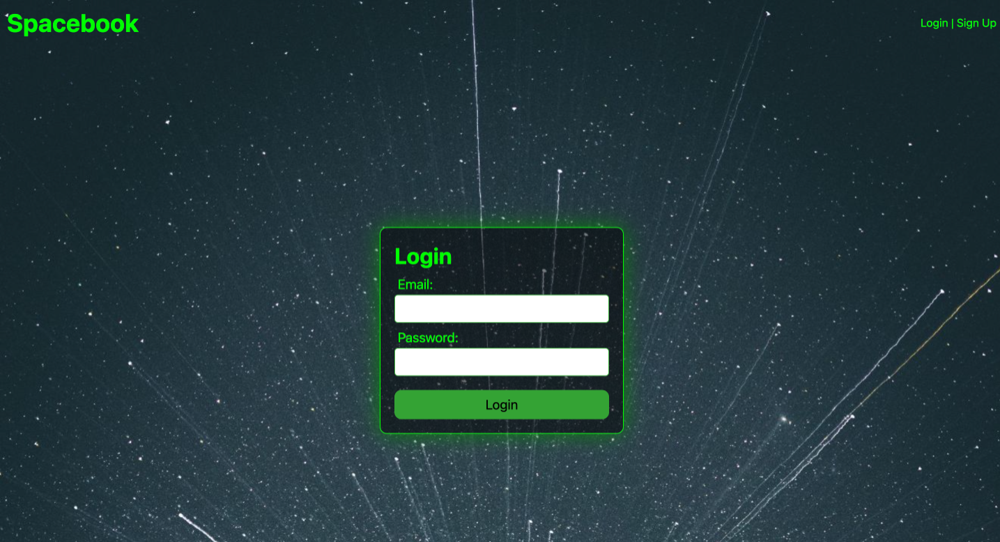

# **Spacebook**

## Description

Alien Social Network: Introducing an extraterrestrial social network platform where aliens share intergalactic journeys and favorite Earth encounters. Our unique twist: an integrated translator to convert alien languages to English, bridging interstellar communication gaps.

[Link to Spacebook](https://spacebook-socialmedia-app-9c15fa4095df.herokuapp.com/login)

[Link to Spacebook Repository](https://github.com/Aliviahhilliard/Spacebook)

### Demo 

[Link to Spacebook Demo](https://github.com/Aliviahhilliard/Spacebook/assets/131189770/bec285b1-31d9-4469-9f12-03332b7a8c32)

## User Story

* AS AN alien user
* I WANT an intergalactic social media app with an english translator built in
* SO THAT I can post pictures, stories, and engage through likes, comments, and shares

## Acceptance Criteria

* Use Node.js and Express.js to create a RESTful API.
* Use Handlebars.js as the template engine.
* Use MySQL and the Sequelize ORM for the database.
* Have both GET and POST routes for retrieving and adding new data.
* Use at least one new library, package, or technology that we haven’t discussed.
* Have a folder structure that meets the MVC paradigm.
* Include authentication (express-session and cookies).
* Protect API keys and sensitive information with environment variables.
* Be deployed using Heroku (with data).
* Have a polished UI.
* Be responsive.
* Be interactive (i.e., accept and respond to user input).
* Meet good-quality coding standards (file structure, naming conventions, follows best practices for class/id naming conventions, indentation, quality comments, etc.).
* Have a professional README (with unique name, description, technologies used, screenshot, and link to deployed application).

## Technologies Used

* Node.js
* Express.js
* Handlebars.js
* MySQL
* Sequelize ORM

## Features

* WHEN a user signs up,
* THEN they can create their profile with a randonly added profile picture.
* WHEN a user adds a friend,
* THEN they can view and engage with that friend's content.
* WHEN a user posts content,
* THEN it appears on their timeline for friends to interact with.
* WHEN a user clicks on the translate all button,
* THEN the text will translate from alien text to English and vice versa.

## Installation

1. Clone the repository
2. Navigate to the directory and run `npm install`
3. Set up your environment variables for database connection and any other sensitive data.
4. Use the schema.sql in the db folder to set up your database in MySQL.
5. Run `npm start` to start the server.

## Contribution

This project is made by Elijah Francis, Luken Hoffman, Jake Mckitrick, Aliviah Hilliard. Contributions are welcome. Fork the repository, make your changes, and then submit a pull request.

## Authors

* [@MCKITT77](https://github.com/MCKIT77)
* [@ElijahAFrancis](https://github.com/ElijahAFrancis)
* [@Aliviahhilliard](https://github.com/Aliviahhilliard)
* [@lukenhoffman](https://github.com/lukenhoffman)

## License

This project uses the [MIT](https://choosealicense.com/licenses/mit/) license.

---

Thank you for checking out our project! Feel free to contact us for any feedback or questions.

---
---
